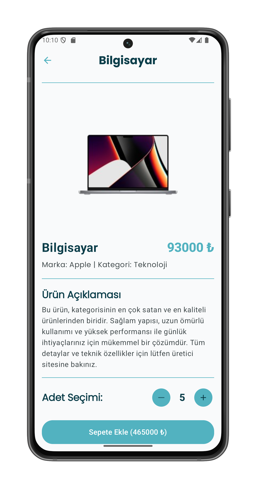

# 🛒 UniShop | Android E-Ticaret Uygulaması (Bootcamp Bitirme Projesi)

Bu proje, bir Android Bootcamp'in bitirme projesi olarak **Kotlin** programlama dili ve modern Android geliştirme araçları kullanılarak geliştirilmiş tam teşekküllü bir **mobil E-Ticaret uygulamasıdır**.  
Ürün listeleme, detay görüntüleme, arama ve sepet yönetimi gibi temel E-Ticaret fonksiyonlarını barındırır.

---

## ✨ Uygulama Özellikleri (Detaylı Görsel Sunum)

---

### 🏠 1. Ürün Listeleme (Home Screen)

**Kategori:** Ürün  

Ana sayfada tüm ürünler, kategorisine bakılmaksızın listelenir.  
Kullanıcılar ürün kartlarına tıklayarak detay sayfasına geçebilir.

---

### 🔍 2. Canlı Arama

**Kategori:** Arama  

Kullanıcı arama kutusuna yazı yazmaya başladığı anda, **marka** veya **ürün adına** göre filtreleme anlık olarak yapılır ve sonuçlar kullanıcıya dinamik olarak sunulur.

---

### 📄 3. Ürün Detay Sayfası

**Kategori:** Detay  

Seçilen ürünün resmi, tam fiyatı, markası ve kategorisi büyük bir ekranda gösterilir.  
Bu ekran, **sepete ekleme işlemi** için bir merkez görevi görür.

---

### ➕ 4. Adet Seçimi

**Kategori:** Sepet  

Ürün detay sayfasında, kullanıcı sepete eklemeden önce istediği sipariş adedini pratik bir şekilde artırıp azaltabilir.  
Toplam fiyat, seçilen adete göre anlık güncellenir.

---

### 🛍️ 5. Sepete Ekleme

**Kategori:** Sepet  

Kullanıcı, istediği adeti seçtikten sonra **"Sepete Ekle"** butonuna basarak ürünü **API'ye POST işlemi** ile sepete kaydeder.  
İşlem başarılı olduktan sonra genellikle ana sayfaya geri dönülür.

---

### 🧾 6. Sepet Görüntüleme

**Kategori:** Sepet  

Ana sayfadaki sepet ikonuna tıklandığında, kullanıcının sepetteki tüm ürünleri listelenir.  
Bu ekranda ürünlerin adedi, fiyatları ve tüm sepetin toplam tutarı net bir şekilde gösterilir.

---

### ❌ 7. Sepetten Silme

**Kategori:** Sepet  

Kullanıcı, sepetteki herhangi bir ürünün yanındaki silme butonuna tıklayarak (API'ye `sepetId` gönderimi ile) ürünü sepetinden kalıcı olarak kaldırabilir.  
Liste ve toplam fiyat anlık olarak güncellenir.

---

## 🛠️ Kullanılan Teknolojiler

Bu proje, modern Android mimarisinin en iyi pratiklerini takip etmek için aşağıdaki kritik bileşenleri kullanır:

- **Programlama Dili:** Kotlin  
- **Arayüz:** Jetpack Compose (Modern, deklaratif UI)  
- **Mimarî:** MVVM (Model-View-ViewModel)  
- **Bağımlılık Yönetimi (DI):** Hilt (Dagger Hilt)  
- **Ağ İşlemleri:** Retrofit & GSON (REST API ile hızlı iletişim)  
- **Asenkron İşlemler:** Kotlin Coroutines & Flow (Veri akışını yönetmek için)  
- **Resim Yükleme:** Coil (URL'den resimleri hızlıca yüklemek ve önbelleğe almak için)  
- **Navigasyon:** Jetpack Compose Navigation

---

## ⚙️ Proje Mimarisi

Uygulama, **temiz kod prensiplerini** ve **modülerliği** sağlamak için Katmanlı Mimari (Layered Architecture) kullanılarak tasarlanmıştır.

### 📂 Data Katmanı

- **Entity:** `Product.kt`, `CartProduct.kt`  
  (API'den gelen JSON verilerini karşılayan veri modelleri)  
- **DataSource:** `ProductService.kt`  
  (Retrofit arayüzü ile API uç noktalarını tanımlar)

### 🧠 Domain (Repository) Katmanı

- **Repository:** `ProductRepository.kt`  
  (Veri kaynakları (API) ile ViewModel'ler arasında köprü görevi görür, iş mantığını soyutlar.)

### 🎨 Presentation (UI/Logic) Katmanı

- **ViewModel:** `HomeViewModel.kt`, `CartViewModel.kt`  
  (Veriyi hazırlar ve iş mantığını yönetir.)  
- **UI:** `AppNavigation.kt`, `HomeScreen.kt`, `DetailScreen.kt`, `CartScreen.kt`  
  (Kullanıcı arayüzü bileşenleri)

---

## 📸 Uygulama Ekran Görüntüleri (Özet)

1. **Ana Sayfa (Home Screen)**  
   

2. **Ürün Detay Sayfası (Detail Screen)**  
   

3. **Sepet Sayfası (Cart Screen)**  
   

---

## 🚀 Kurulum, Çalıştırma, Teşekkür ve İletişim

**Projeyi Klonlayın:**  
git clone [GitHub Proje Linkiniz]

**Android Studio'yu Açın:**  
Projeyi Android Studio'da açın.

**Hilt Kurulumu:**  
Gerekli tüm Hilt annotation'larının (örneğin `@HiltAndroidApp` ve `@AndroidEntryPoint`) doğru kullanıldığından emin olun.

**Derleme:**  
Gradle senkronizasyonunun tamamlanmasını bekleyin ve uygulamayı bir emülatör veya fiziksel cihazda çalıştırın.

**🙏 Teşekkür ve 📬 İletişim:**  

Bu projenin geliştirilme sürecindeki rehberliği, engin bilgisi ve motivasyonu için değerli  
**𝐻𝑜𝑐𝑎𝑛ı𝑧ı𝑛 𝐴𝑑ı 𝐵𝑢𝑟𝑎𝑦𝑎**  
HocanızınAdıBuraya’na en içten teşekkürlerimi sunarım.  
Onun desteği olmadan bu projeyi başarıyla tamamlamak mümkün olmazdı.

Proje hakkında herhangi bir sorunuz, geri bildiriminiz veya işbirliği teklifiniz varsa, aşağıdaki kanallardan benimle iletişime geçebilirsiniz:

**📧 E-posta:** [E-posta Adresiniz]  
**🔗 LinkedIn / GitHub:** [Sosyal Medya / LinkedIn / GitHub Profil Linkiniz]

